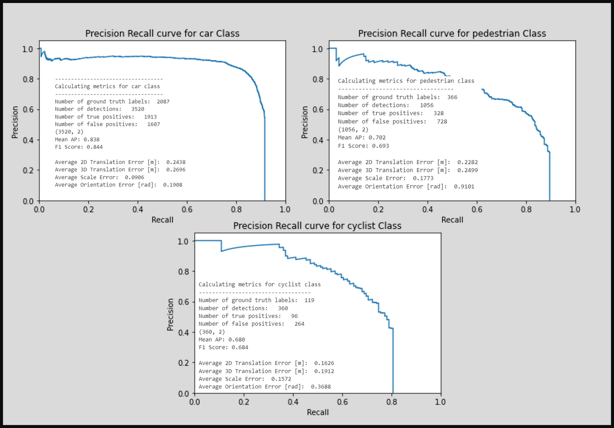
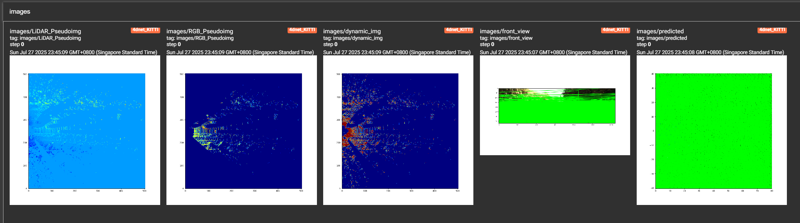

# 4D Net Pytorch Implementation KITTI (RGB+LiDAR)

- Dataset: [KITTI 3D Dataset](https://www.kaggle.com/datasets/garymk/kitti-3d-object-detection-dataset/data)
- Weights available at :[Link to Weights](https://nextcloud.chan-cloud.com/s/Jk3pDi2gn7z6SNs)
  - password:4dnetpytorch
- This repo is an attempt at implementing 4D Net https://arxiv.org/abs/2109.01066
- NO TEMPORAL ELEMENT (RGB+LiDAR only, no Time)
  - This repo serves only as a tutorial for myself
  - I may have missed out some stuff from the paper
- Feel free to download this repo and implement the temporal elements yourself

## Visual Results


## Evaluation mAP

- Evaluation Code from https://github.com/jacoblambert/3d_lidar_detection_evaluation
  

## Model Details


- The Model consist of a PointNet Processing model, an RGB Processing Model, PseudoImage Scattering Layer and a Efficient-Det style Single Shot Detector as object detection head
- During Training, the Pseudo Images will look like this in Tensorboard and important objects should get more pronounced
- For matching the targets to predicted outputs, i used a hungarian matcher used in DETR/Deformable-DETR
- Half of the effort here is to let the dataset grab the relavant RGB feature coordinates - These coordinates are used to grab the CNN features from the RGB Image to create a sepearte Pseudo Image - This is then concatenated with the LiDAR Point Pillars Pseudo Image later
  

## Anchorbox Calculation

- K-Means analysis of ground truth boxes are used
- Look at Stats.ipynb

## How to Train/Infer

1. Build the docker container

```bash
docker buildx build -f ./docker/dockerfile -t 4dnet:0.1 .
```

2. Once in the container environment, train using the command:

```bash
python -m train /mnt/datasets/kitti_dataset/training --epochs 100 --tensorboard_logs ./tensorboard_logs/training
```

3. During training, plots of the model's inference will be logged in tensorboard:
   
