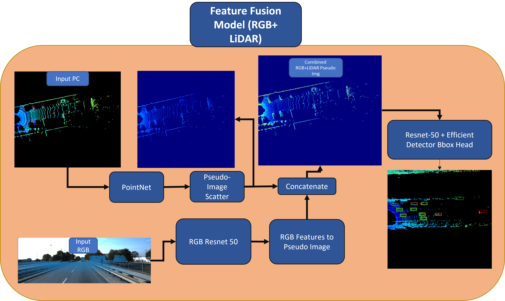
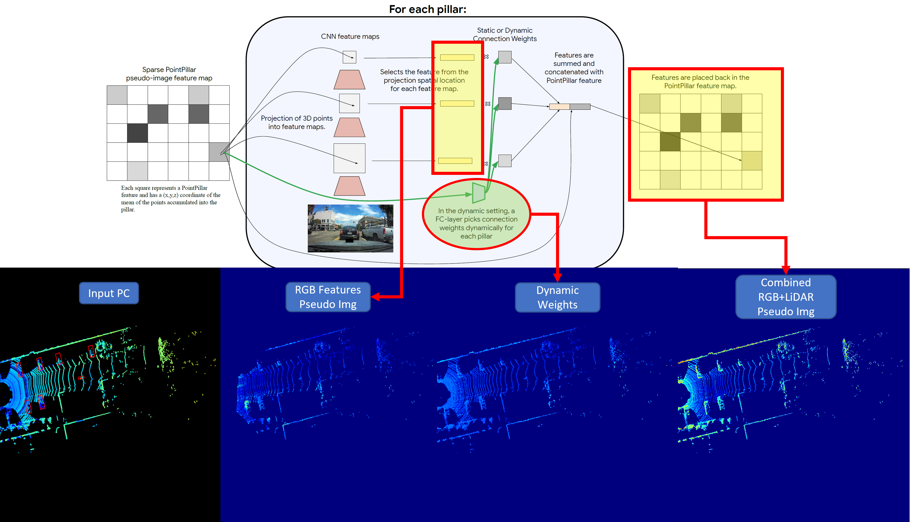

# 4D Net Pytorch Implementation KITTI (RGB+LiDAR)
- This repo is an attempt at implementing 4D Net https://arxiv.org/abs/2109.01066
- NO TEMPORAL ELEMENT (RGB+LiDAR only, no Time)
    - This repo serves only as a tutorial for myself
    - I may have missed out some stuff from the paper
- Feel free to download this repo and implement the temporal elements yourself


## Model Details 

- The Model consist of a PointNet Processing model, an RGB Processing Model, PseudoImage Scattering Layer and a Efficient-Det style Single Shot Detector as object detection head
- During Training, the Pseudo Images will look like this in Tensorboard and important objects should get more pronounced
- For matching the targets to predicted outputs, i used a hungarian matcher used in DETR/Deformable-DETR
- Half of the effort here is to let the dataset grab the relavant RGB feature coordinates
    - These coordinates are used to grab the CNN features from the RGB Image to create a sepearte Pseudo Image
    - This is then concatenated with the LiDAR Point Pillars Pseudo Image later


## How to Train
- Edit the dataset root location in train_KITTI.py:
```python
    from KITTI_dataset import kitti_dataset,KITTI_collate_fn
    from pillar_models import NET_4D_EffDet
    
    batch_size = 4
    xyz_range = np.array([0,-40.32,-2,80.64,40.32,3])
    xy_voxel_size= np.array([0.16,0.16])
    points_per_pillar = 100
    n_pillars=12000

    dataset = kitti_dataset(root = "/home/conda/RAID_5_14TB/DATASETS/KITTI_dataset/training/" , xyz_range = xyz_range,xy_voxel_size= xy_voxel_size,points_per_pillar = points_per_pillar,n_pillars=n_pillars)
    data_loader_train = DataLoader(dataset, batch_size=batch_size,collate_fn= KITTI_collate_fn, num_workers=8, shuffle=True)

    anchor_dict = np.load("./cluster_kitti_3scales_3anchor.npy",allow_pickle=True).item()
    model = NET_4D_EffDet(anchor_dict,n_classes=4)
    model.cuda()
    for i,(img,(pillars, coord, contains_pillars),(pillar_img_pts,rgb_coors,contains_rgb),targets) in enumerate(data_loader_train):
        pred,_,_= model(img.cuda(),pillars.float().cuda(), coord.cuda(), contains_pillars.cuda(),pillar_img_pts.float().cuda(),rgb_coors.cuda(),contains_rgb.cuda())
     
    print(pred["pred_logits"].shape) #torch.Size([2, 15747, 4])
    print(pred["pred_boxes"].shape) #torch.Size([2, 15747, 7]) #x,y,z,w,l,h,r

```